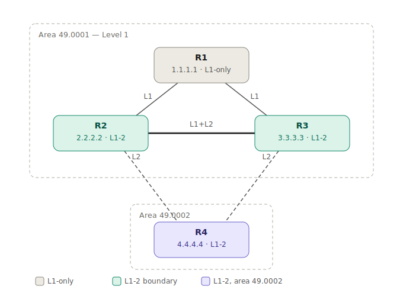

# IGP Deep Dive — IS-IS (with OSPF comparison) on Cisco IOS XRv9000 — EVE-NG Lab


The IGP is the foundation every other protocol stands on — your iBGP sessions, your MPLS/SR
transport, your loopback reachability all depend on it. This lab takes IS-IS past "make the
adjacency come up" and into the parts that actually matter: the link-state database, metric
design, multi-level areas, route leaking, and sub-second convergence. Then it builds **OSPF on
the same topology** so you can compare them line by line and understand *why service providers
choose IS-IS*.

> **How to use this lab:** follow the phases in order. Paste that phase's config, `commit`, run the
> verify commands, confirm — *then* move on. The point isn't a working adjacency (easy); it's being
> able to read the LSDB and **explain why each route takes the path it does**. Each phase ends with
> a "Can I explain it?" question.
>
> Theory → [`docs/CONCEPTS.md`](docs/CONCEPTS.md) ·
> Metrics & levels → [`docs/METRICS-AND-LEVELS.md`](docs/METRICS-AND-LEVELS.md) ·
> Convergence → [`docs/FAST-CONVERGENCE.md`](docs/FAST-CONVERGENCE.md) ·
> IS-IS vs OSPF → [`docs/ISIS-vs-OSPF.md`](docs/ISIS-vs-OSPF.md)

> **Same diamond as the BGP / MPLS-TE / SRv6 labs** — same routers, links, and loopbacks. Do this
> lab **first**: it's the foundation the BGP lab's iBGP sessions ride on.

---

## Two ways to build this lab

**A. Fast path (just get it running).** Paste each device's full final-state config from
[`configs/`](configs/), `commit`, done. Use this when you already understand the design or are
rebuilding the topology as a base for another lab.

**B. Learning path (recommended — phase by phase).** Build flat first, then change *one thing* per
phase and watch the `show` output move. The payoff is in the **diff**: e.g. before Phase 4 route
leaking, R1 sees `4.4.4.4` only as a default route; after, it sees the leaked `/32`. Paste all at
once and you never see that contrast — which is the whole lesson. Each phase below has a
**► Configure** block with the exact commands to add for that phase, per device.

The `configs/*.txt` files are the **final state**; each line is tagged with the `! Phase N` that
introduced it, so they double as an answer key for path B.

### The paste ritual (do this for every phase)

New to IOS-XR? This is the exact loop you repeat in **every** phase below. XR stages your edits in a
**candidate buffer** and applies them only on `commit`, so a whole phase lands as one clean, atomic
change you can verify:

1. **Pick the router** the block is labelled for (each phase lists them, e.g. **R1**, **R2**…).
2. On that router, type `config` (or `configure terminal`). **Nothing is live yet** — you're editing
   a *candidate* copy.
3. **Paste that router's block** for the phase.
4. Type `commit`. **This is the moment it goes live.** (Made a mess? Type `abort` — it discards the
   candidate and changes nothing.)
5. Type `end` to leave config mode, then move to the next router the phase lists.
6. When every router in the phase is done, run that phase's **Verify** commands before moving on.

```
config
  ... paste the phase block ...
commit          ! nothing takes effect until here
end
```

- **New XRv interfaces can come up admin-down** — the blocks include `no shutdown`; keep it when
  pasting a fresh node.
- Already committed and want it gone? `rollback configuration last 1`.
- See exactly what a commit changed: `show configuration commit changes last 1`.

---

## TL;DR — quick verify (once built)

```
show isis neighbors                 ! adjacencies + their level (L1 / L2 / L1L2)
show isis database                  ! the LSDB — who advertises what
show route isis                     ! L1 routes (R1) vs L2 routes (R2/R3/R4)
ping 4.4.4.4 source 1.1.1.1         ! R1 (L1-only) reaching R4 (other area) via leaked route
```

Want the OSPF comparison? Wipe IS-IS and paste [`configs/ospf/`](configs/ospf/) instead.

---

## Lab Environment

| Component | Detail |
|---|---|
| Emulator | EVE-NG (Community/Pro) |
| Node image | Cisco IOS XRv9000 (24.3.1) |
| Nodes | 4 × XRv9000 (R1–R4) |
| Protocol | IS-IS (primary) · OSPF (comparison build) |
| Links | All point-to-point (no DIS/DR election to distract) |

---

## Topology

```
                +-------+        L1 (area 49.0001)
        +-------|  R1   |-------+
        |       | L1    |       |
   L1   |       +-------+       |  L1
        |                       |
   +----+---+   L1+L2 x-link  +-+------+
   |  R2    |-----------------|  R3    |   R2,R3 = L1/L2 boundary (area 49.0001)
   | L1L2   |                 | L1L2   |
   +----+---+                 +---+----+
        |   L2-only      L2-only  |
        +-----------+ +-----------+
                    | |
                +---+-+---+
                |  R4     |   area 49.0002  (reached over the L2 backbone)
                | L1L2    |
                +---------+
```



- **R1** — Level-1 only, area 49.0001. Sees only its area; reaches everything else via a default
  route (the *attached bit*) — until Phase 4 leaks the specifics it needs.
- **R2, R3** — Level-1-2 boundary routers. L1 toward R1 and each other; L2 toward R4. They are the
  glue between the two areas, and the route leakers.
- **R4** — alone in area 49.0002, reached across the L2 backbone.

See [`diagrams/topology.md`](diagrams/topology.md) for the level/area map and the OSPF equivalent.

---

## Addressing Plan

| Node | IS-IS role | Area / NET | Loopback0 |
|------|-----------|-----------|-----------|
| R1 | Level-1 only | 49.0001 — `49.0001.0000.0000.0001.00` | 1.1.1.1/32 |
| R2 | Level-1-2 (boundary) | 49.0001 — `...0002.00` | 2.2.2.2/32 |
| R3 | Level-1-2 (boundary) | 49.0001 — `...0003.00` | 3.3.3.3/32 |
| R4 | Level-1-2 | 49.0002 — `49.0002.0000.0000.0004.00` | 4.4.4.4/32 |

| Link | Subnet | A-end | B-end | IS-IS adjacency |
|------|--------|-------|-------|-----------------|
| R1–R2 | 10.12.0.0/30 | R1 Gi0/0/0/1 .1 | R2 Gi0/0/0/0 .2 | L1 |
| R1–R3 | 10.13.0.0/30 | R1 Gi0/0/0/3 .1 | R3 Gi0/0/0/2 .2 | L1 |
| R2–R3 (cross) | 10.23.0.0/30 | R2 Gi0/0/0/1 .1 | R3 Gi0/0/0/0 .2 | L1 + L2 |
| R2–R4 | 10.24.0.0/30 | R2 Gi0/0/0/3 .1 | R4 Gi0/0/0/2 .2 | L2-only |
| R3–R4 | 10.34.0.0/30 | R3 Gi0/0/0/4 .1 | R4 Gi0/0/0/3 .2 | L2-only |

**NET decoded** (`49.0001.0000.0000.0001.00`): `49` = AFI (private), `0001` = area, `0000.0000.0001`
= system-id (must be unique, 6 bytes), `00` = NSEL (always 00 on a router). See `docs/CONCEPTS.md`.

---

## Phases

| Phase | Topic | The "real engineer" question it answers | Who changes |
|-------|-------|------------------------------------------|-------------|
| 1 | Single-area baseline | What's actually in an adjacency, and when does it form? | all |
| 2 | LSDB + metric design | What's *in* the database, and how do metrics pick the path? | all |
| 3 | Multi-level areas | What do L1 vs L2 see, and what's the *attached bit*? | all |
| 4 | Route leaking + summarization | Why is L1 routing suboptimal, and how do you fix it safely? | R2, R3 |
| 5 | Fast convergence | How do you get from seconds to sub-second failover? | all |
| 6 | OSPF comparison | Same network in OSPF — why do SPs pick IS-IS? | all (OSPF build) |

---

## Results

- [ ] **Phase 1** — all 5 adjacencies up (single area), LSDB synchronized, loopbacks reachable
- [ ] **Phase 2** — wide metrics in use; path to R4 follows metric design; ECMP where metrics tie
- [ ] **Phase 3** — R1 is L1-only; R1's table shows a default route, not R4's loopback; ATT bit set on R2/R3
- [ ] **Phase 4** — 4.4.4.4/32 leaked into L1; R1 now has the specific route and the optimal path
- [ ] **Phase 5** — BFD sessions up; link failure reroutes via LFA in <50ms; LSP auth verified
- [ ] **Phase 6** — OSPF build adjacent; areas/LSAs mapped to the IS-IS equivalents

---

## Phase 1 — Single-area baseline

**Objective:** one flat area, all Level-2, every loopback reachable. Understand what an adjacency
*is* before you start slicing it into levels.

Everyone is `level-2-only` in a single area `49.0001` (R4 moves to its own area later, in Phase 3).
All links point-to-point, so there's **no DIS** — that election only happens on broadcast/LAN
circuits. Loopbacks are `passive` (advertised, but form no adjacency).

<details>
<summary><b>► Configure Phase 1 — paste per device</b></summary>

*First time? → follow [the paste ritual](#the-paste-ritual-do-this-for-every-phase).*
**Paste order:** R1 → R2 → R3 → R4 (paste each router's block, `commit`, then the next).

**R1**
```
interface Loopback0
 ipv4 address 1.1.1.1 255.255.255.255
 no shutdown
!
interface GigabitEthernet0/0/0/1
 ipv4 address 10.12.0.1 255.255.255.252
 no shutdown
!
interface GigabitEthernet0/0/0/3
 ipv4 address 10.13.0.1 255.255.255.252
 no shutdown
!
router isis CORE
 is-type level-2-only
 net 49.0001.0000.0000.0001.00
 address-family ipv4 unicast
 !
 interface Loopback0
  passive
  address-family ipv4 unicast
  !
 !
 interface GigabitEthernet0/0/0/1
  point-to-point
  address-family ipv4 unicast
  !
 !
 interface GigabitEthernet0/0/0/3
  point-to-point
  address-family ipv4 unicast
  !
 !
!
commit
```

**R2**
```
interface Loopback0
 ipv4 address 2.2.2.2 255.255.255.255
 no shutdown
!
interface GigabitEthernet0/0/0/0
 ipv4 address 10.12.0.2 255.255.255.252
 no shutdown
!
interface GigabitEthernet0/0/0/1
 ipv4 address 10.23.0.1 255.255.255.252
 no shutdown
!
interface GigabitEthernet0/0/0/3
 ipv4 address 10.24.0.1 255.255.255.252
 no shutdown
!
router isis CORE
 is-type level-2-only
 net 49.0001.0000.0000.0002.00
 address-family ipv4 unicast
 !
 interface Loopback0
  passive
  address-family ipv4 unicast
  !
 !
 interface GigabitEthernet0/0/0/0
  point-to-point
  address-family ipv4 unicast
  !
 !
 interface GigabitEthernet0/0/0/1
  point-to-point
  address-family ipv4 unicast
  !
 !
 interface GigabitEthernet0/0/0/3
  point-to-point
  address-family ipv4 unicast
  !
 !
!
commit
```

**R3**
```
interface Loopback0
 ipv4 address 3.3.3.3 255.255.255.255
 no shutdown
!
interface GigabitEthernet0/0/0/0
 ipv4 address 10.23.0.2 255.255.255.252
 no shutdown
!
interface GigabitEthernet0/0/0/2
 ipv4 address 10.13.0.2 255.255.255.252
 no shutdown
!
interface GigabitEthernet0/0/0/4
 ipv4 address 10.34.0.1 255.255.255.252
 no shutdown
!
router isis CORE
 is-type level-2-only
 net 49.0001.0000.0000.0003.00
 address-family ipv4 unicast
 !
 interface Loopback0
  passive
  address-family ipv4 unicast
  !
 !
 interface GigabitEthernet0/0/0/0
  point-to-point
  address-family ipv4 unicast
  !
 !
 interface GigabitEthernet0/0/0/2
  point-to-point
  address-family ipv4 unicast
  !
 !
 interface GigabitEthernet0/0/0/4
  point-to-point
  address-family ipv4 unicast
  !
 !
!
commit
```

**R4** *(temporarily in area 49.0001 for the flat build; Phase 3 moves it to 49.0002)*
```
interface Loopback0
 ipv4 address 4.4.4.4 255.255.255.255
 no shutdown
!
interface GigabitEthernet0/0/0/2
 ipv4 address 10.24.0.2 255.255.255.252
 no shutdown
!
interface GigabitEthernet0/0/0/3
 ipv4 address 10.34.0.2 255.255.255.252
 no shutdown
!
router isis CORE
 is-type level-2-only
 net 49.0001.0000.0000.0004.00
 address-family ipv4 unicast
 !
 interface Loopback0
  passive
  address-family ipv4 unicast
  !
 !
 interface GigabitEthernet0/0/0/2
  point-to-point
  address-family ipv4 unicast
  !
 !
 interface GigabitEthernet0/0/0/3
  point-to-point
  address-family ipv4 unicast
  !
 !
!
commit
```
</details>

**Verify**

```
show isis neighbors                 ! 5 adjacencies, state Up
show isis adjacency detail          ! the three-way handshake, hold time
show isis database                  ! one LSP per router; same DB on all nodes
ping 4.4.4.4 source 1.1.1.1
```

> **Can I explain it?** On a point-to-point link, why is there no DIS election? (No pseudonode is
> needed — there are only two routers, so flooding is already efficient.)

---

## Phase 2 — The LSDB and metric design

**Objective:** read the link-state database, and shape the path with metrics instead of accepting
defaults.

**The database is the protocol.** Every router floods one (or more) **LSP** describing its own
links and their metrics. Every router stores *every* LSP — the synchronized LSDB. Each then runs
**SPF (Dijkstra)** on that identical database to compute its own shortest-path tree. If two routers
disagree on a route, their databases differ — that's always where you look.

**Wide metrics, always.** `metric-style wide` gives 24-bit interface metrics (and 32-bit totals)
instead of the legacy 6-bit (max 63) "narrow" metrics. Narrow metrics can't express modern designs
and break TE/SR extensions. Set wide on day one, then give every link an explicit metric.

<details>
<summary><b>► Configure Phase 2 — add wide metrics + per-link metric (all devices)</b></summary>

*First time? → follow [the paste ritual](#the-paste-ritual-do-this-for-every-phase).*
**Paste order:** R1 → R2 → R3 → R4 (all four routers change this phase).

**R1**
```
router isis CORE
 address-family ipv4 unicast
  metric-style wide
 !
 interface GigabitEthernet0/0/0/1
  address-family ipv4 unicast
   metric 10
  !
 !
 interface GigabitEthernet0/0/0/3
  address-family ipv4 unicast
   metric 10
  !
 !
!
commit
```

**R2**
```
router isis CORE
 address-family ipv4 unicast
  metric-style wide
 !
 interface GigabitEthernet0/0/0/0
  address-family ipv4 unicast
   metric 10
  !
 !
 interface GigabitEthernet0/0/0/1
  address-family ipv4 unicast
   metric 10
  !
 !
 interface GigabitEthernet0/0/0/3
  address-family ipv4 unicast
   metric 10
  !
 !
!
commit
```

**R3**
```
router isis CORE
 address-family ipv4 unicast
  metric-style wide
 !
 interface GigabitEthernet0/0/0/0
  address-family ipv4 unicast
   metric 10
  !
 !
 interface GigabitEthernet0/0/0/2
  address-family ipv4 unicast
   metric 10
  !
 !
 interface GigabitEthernet0/0/0/4
  address-family ipv4 unicast
   metric 10
  !
 !
!
commit
```

**R4**
```
router isis CORE
 address-family ipv4 unicast
  metric-style wide
 !
 interface GigabitEthernet0/0/0/2
  address-family ipv4 unicast
   metric 10
  !
 !
 interface GigabitEthernet0/0/0/3
  address-family ipv4 unicast
   metric 10
  !
 !
!
commit
```
</details>

**The diamond is a metric playground.** With all links = 10, R1→R4 is ECMP via R2 and R3 (cost 20
each). Raise R1–R3 to 100 (`metric 100` on R1 Gi0/0/0/3 **and** R3 Gi0/0/0/2) and watch the path
collapse onto R1→R2→R4. Metrics, not luck, decide. Set it back to 10 before moving on.

**Verify**

```
show isis database detail           ! see each router's links + metrics inside its LSP
show isis route                      ! IS-IS's computed routes (pre-RIB)
show route 4.4.4.4                   ! ECMP? change a metric and re-check
show isis topology                   ! the SPF tree
```

> **Can I explain it?** Two routers show different paths to the same prefix. What's the *first*
> thing you check? (Whether their `show isis database` actually matches — a desync is the usual cause.)

---

## Phase 3 — Multi-level areas

**Objective:** split the flat domain into two areas and watch the L1/L2 hierarchy appear. This is
how IS-IS scales — and where most operators' understanding gets fuzzy.

**The mental model:**
- **Level 1** = *intra-area*. An L1 router knows only its own area in detail. To reach anything
  outside, it follows a **default route** to the nearest L1/L2 router that has the **attached (ATT)
  bit** set.
- **Level 2** = *inter-area backbone*. L2 must be **contiguous** (an unbroken backbone) — the IS-IS
  equivalent of OSPF area 0, but more flexible (no strict "everything touches area 0" rule).
- **Level 1-2** = both. These boundary routers (R2, R3) bridge the two and set the ATT bit in their
  L1 LSP to say "send your unknown traffic to me."

This phase makes R1 L1-only, promotes R2/R3 to L1-2 boundaries, and **moves R4 into a new area
49.0002** with L2-only links to the backbone. On IOS-XR you change the area by removing the old
NET and adding the new one.

<details>
<summary><b>► Configure Phase 3 — introduce levels + move R4 to area 49.0002</b></summary>

*First time? → follow [the paste ritual](#the-paste-ritual-do-this-for-every-phase).*
**Paste order:** R1 → R2 → R3 → R4 (all four change; expect adjacencies to briefly drop as levels/areas shift).

**R1** — become Level-1 only; both links are L1
```
router isis CORE
 is-type level-1
 interface GigabitEthernet0/0/0/1
  circuit-type level-1
 !
 interface GigabitEthernet0/0/0/3
  circuit-type level-1
 !
!
commit
```

**R2** — boundary; L1 to R1, keep L1+L2 to R3 (default), L2-only to R4
```
router isis CORE
 is-type level-1-2
 interface GigabitEthernet0/0/0/0
  circuit-type level-1
 !
 interface GigabitEthernet0/0/0/3
  circuit-type level-2-only
 !
!
commit
```

**R3** — boundary; L1 to R1, keep L1+L2 to R2 (default), L2-only to R4
```
router isis CORE
 is-type level-1-2
 interface GigabitEthernet0/0/0/2
  circuit-type level-1
 !
 interface GigabitEthernet0/0/0/4
  circuit-type level-2-only
 !
!
commit
```

**R4** — move to area 49.0002; both links L2-only (they cross the area boundary)
```
router isis CORE
 no net 49.0001.0000.0000.0004.00
 net 49.0002.0000.0000.0004.00
 is-type level-1-2
 interface GigabitEthernet0/0/0/2
  circuit-type level-2-only
 !
 interface GigabitEthernet0/0/0/3
  circuit-type level-2-only
 !
!
commit
```
</details>

**Verify**

```
show isis database level-1          ! R1's view — its area only
show isis database level-2          ! the backbone view — both areas' summaries
show route isis                      ! ON R1: a default (0.0.0.0/0), NOT 4.4.4.4/32 yet
show isis neighbors                  ! note the level of each adjacency (L1 vs L2)
```

Expected on R1: a default route via R2/R3 (ATT bit), and **no specific** route to 4.4.4.4 — so
traffic to R4 follows the default, which may be suboptimal. That's the problem Phase 4 solves.

> **Can I explain it?** What does the attached bit do, and why doesn't R1 see R4's loopback yet?
> (ATT tells L1 routers "I can reach other areas — default to me." L2→L1 specifics aren't leaked by
> default, so R1 only has the default.)

---

## Phase 4 — Route leaking and summarization

**Objective:** fix L1's suboptimal routing by **leaking** the specific L2 prefix R1 needs, and
understand summarization at the boundary. **Only the boundary routers (R2, R3) change.**

**Why default routing goes wrong.** R1 reaches *both* R2 and R3 at equal cost and defaults to
both. But if R4 is actually closer via one of them, the default can send traffic the long way.
Leaking the **specific** route (4.4.4.4/32) into L1 lets R1 run real SPF to R4 and pick the truly
shortest path.

**The loop-prevention catch.** L1→L2 happens automatically; **L2→L1 is blocked by default** to
prevent loops. When you leak manually, IOS-XR sets a **down bit** on the route so an L1L2 router
won't push it back up into L2. Leak deliberately and sparingly.

<details>
<summary><b>► Configure Phase 4 — leak 4.4.4.4/32 into L1 (R2 and R3 only — identical)</b></summary>

*First time? → follow [the paste ritual](#the-paste-ritual-do-this-for-every-phase).*
**Paste order:** R2, then R3 (only the two boundary routers — the exact same block on each).

**R2 and R3** (paste the same block on each)
```
prefix-set LEAKED-FROM-L2
  4.4.4.4/32
end-set
!
route-policy LEAK-L2-TO-L1
  if destination in LEAKED-FROM-L2 then
    pass
  else
    drop
  endif
end-policy
!
router isis CORE
 address-family ipv4 unicast
  propagate level 2 into level 1 route-policy LEAK-L2-TO-L1
 !
!
commit
```
</details>

**Summarization** (the other lever): at the boundary you can advertise `172.16.0.0/16` instead of
many `/24`s with `summary-prefix`. Fewer LSPs, smaller LSDB, less churn — at the cost of detail.
The trade-off (scale vs optimality) is the heart of area design.

**Verify**

```
! ON R1, after leaking:
show route 4.4.4.4                   ! now a SPECIFIC /32, not just the default
show route isis | include 4.4.4.4
traceroute 4.4.4.4 source 1.1.1.1   ! confirm it now takes the optimal path
```

> **Can I explain it?** Why is L2→L1 leaking blocked by default but L1→L2 isn't? (Loop
> prevention — leaked-down routes carry a down bit so a boundary router won't re-advertise them up.)

---

## Phase 5 — Fast convergence

**Objective:** go from "seconds to notice a failure" to **sub-second** with BFD, and from
"recompute then reroute" to **pre-computed backup** with LFA. Applied on **all devices**.

**The three delays in IGP convergence, and the tool for each:**

1. **Detection** — without help, you wait for hellos to time out (seconds). **BFD** detects a dead
   neighbor in tens of milliseconds and tells IS-IS instantly.
2. **Computation** — SPF runs, but you don't want it firing on every micro-flap. **SPF/LSP-gen
   throttling** (`spf-interval`, `lsp-gen-interval`) backs off intelligently.
3. **Repair** — even fast SPF leaves a gap. **LFA (Loop-Free Alternate)** pre-installs a backup
   next-hop so traffic reroutes the instant the link drops, *before* SPF finishes.

**Authentication** (`lsp-password keychain ...`) signs LSPs so a rogue device can't inject false
topology. Mismatched keys drop the adjacency — a classic "why won't it come up" gotcha. R1 (L1-only)
authenticates level 1; the L1-2 routers authenticate both levels.

<details>
<summary><b>► Configure Phase 5 — BFD + LFA + throttle + auth (all devices)</b></summary>

*First time? → follow [the paste ritual](#the-paste-ritual-do-this-for-every-phase).*
**Paste order:** R1 → R2 → R3 → R4 (all four). The auth keys must match on both ends of every link, or the adjacency drops.

**R1**
```
key chain ISIS-KEY
 key 1
  key-string cisco123
  cryptographic-algorithm HMAC-MD5
 !
!
router isis CORE
 lsp-password keychain ISIS-KEY level 1
 address-family ipv4 unicast
  spf-interval maximum-wait 5000 initial-wait 50 secondary-wait 200
  lsp-gen-interval maximum-wait 5000 initial-wait 50 secondary-wait 200
 !
 interface GigabitEthernet0/0/0/1
  bfd fast-detect ipv4
  bfd minimum-interval 50
  bfd multiplier 3
  address-family ipv4 unicast
   fast-reroute per-prefix
  !
 !
 interface GigabitEthernet0/0/0/3
  bfd fast-detect ipv4
  bfd minimum-interval 50
  bfd multiplier 3
  address-family ipv4 unicast
   fast-reroute per-prefix
  !
 !
!
commit
```

**R2**
```
key chain ISIS-KEY
 key 1
  key-string cisco123
  cryptographic-algorithm HMAC-MD5
 !
!
router isis CORE
 lsp-password keychain ISIS-KEY level 1
 lsp-password keychain ISIS-KEY level 2
 address-family ipv4 unicast
  spf-interval maximum-wait 5000 initial-wait 50 secondary-wait 200
  lsp-gen-interval maximum-wait 5000 initial-wait 50 secondary-wait 200
 !
 interface GigabitEthernet0/0/0/0
  bfd fast-detect ipv4
  bfd minimum-interval 50
  bfd multiplier 3
  address-family ipv4 unicast
   fast-reroute per-prefix
  !
 !
 interface GigabitEthernet0/0/0/1
  bfd fast-detect ipv4
  bfd minimum-interval 50
  bfd multiplier 3
  address-family ipv4 unicast
   fast-reroute per-prefix
  !
 !
 interface GigabitEthernet0/0/0/3
  bfd fast-detect ipv4
  bfd minimum-interval 50
  bfd multiplier 3
  address-family ipv4 unicast
   fast-reroute per-prefix
  !
 !
!
commit
```

**R3**
```
key chain ISIS-KEY
 key 1
  key-string cisco123
  cryptographic-algorithm HMAC-MD5
 !
!
router isis CORE
 lsp-password keychain ISIS-KEY level 1
 lsp-password keychain ISIS-KEY level 2
 address-family ipv4 unicast
  spf-interval maximum-wait 5000 initial-wait 50 secondary-wait 200
  lsp-gen-interval maximum-wait 5000 initial-wait 50 secondary-wait 200
 !
 interface GigabitEthernet0/0/0/0
  bfd fast-detect ipv4
  bfd minimum-interval 50
  bfd multiplier 3
  address-family ipv4 unicast
   fast-reroute per-prefix
  !
 !
 interface GigabitEthernet0/0/0/2
  bfd fast-detect ipv4
  bfd minimum-interval 50
  bfd multiplier 3
  address-family ipv4 unicast
   fast-reroute per-prefix
  !
 !
 interface GigabitEthernet0/0/0/4
  bfd fast-detect ipv4
  bfd minimum-interval 50
  bfd multiplier 3
  address-family ipv4 unicast
   fast-reroute per-prefix
  !
 !
!
commit
```

**R4**
```
key chain ISIS-KEY
 key 1
  key-string cisco123
  cryptographic-algorithm HMAC-MD5
 !
!
router isis CORE
 lsp-password keychain ISIS-KEY level 1
 lsp-password keychain ISIS-KEY level 2
 address-family ipv4 unicast
  spf-interval maximum-wait 5000 initial-wait 50 secondary-wait 200
  lsp-gen-interval maximum-wait 5000 initial-wait 50 secondary-wait 200
 !
 interface GigabitEthernet0/0/0/2
  bfd fast-detect ipv4
  bfd minimum-interval 50
  bfd multiplier 3
  address-family ipv4 unicast
   fast-reroute per-prefix
  !
 !
 interface GigabitEthernet0/0/0/3
  bfd fast-detect ipv4
  bfd minimum-interval 50
  bfd multiplier 3
  address-family ipv4 unicast
   fast-reroute per-prefix
  !
 !
!
commit
```
</details>

> **LFA vs TI-LFA:** plain LFA (this lab) works in pure IP but can't protect *every* topology —
> sometimes there's no loop-free neighbor. **TI-LFA** uses Segment Routing to build a repair path
> to *any* destination, guaranteeing protection. That's exactly what you configured in the
> [SR-MPLS lab](https://github.com/bosamart/sr-mpls-iosxr-eveng-lab) — same problem, solved with SR labels.

**Verify**

```
show bfd session                     ! BFD up, sub-second interval
show isis fast-reroute summary       ! prefixes protected by LFA
show isis interface | include Auth   ! authentication active
! Prove it: long ping, then shut one link mid-stream:
ping 4.4.4.4 source 1.1.1.1 count 100000
! (shut R1's Gi0/0/0/1) -> expect near-zero loss as LFA reroutes via R3
```

> **Can I explain it?** Why does BFD alone not give you sub-second *convergence*, only sub-second
> *detection*? (Detection is step 1; you still need a pre-computed backup (LFA) to forward during
> the SPF/FIB-update gap.)

At this point every router matches its final-state file in [`configs/`](configs/).

---

## Phase 6 — OSPF on the same topology (comparison)

**Objective:** build OSPF on the identical diamond, map every concept across, and understand the
SP preference for IS-IS. Full side-by-side in [`docs/ISIS-vs-OSPF.md`](docs/ISIS-vs-OSPF.md).

Wipe IS-IS (`no router isis CORE` on each node, `commit`) and paste [`configs/ospf/`](configs/ospf/).
Area mapping:

| IS-IS | OSPF |
|-------|------|
| L2 backbone | **area 0** (mandatory backbone) |
| L1 area 49.0001 (R1) | **area 1** |
| R2/R3 L1L2 boundary | **ABR** (Area Border Router) |
| R4 (area 49.0002) | **area 0** |

**Concepts that rhyme:** LSP↔LSA, LSDB↔LSDB, SPF↔SPF, DIS↔DR/BDR, metric↔cost, ATT bit↔default
from ABR. **Where they differ (and why SPs lean IS-IS):**

- IS-IS runs directly on Layer 2 (not in IP) → it's address-family agnostic; **one instance carries
  IPv4, IPv6, and SR** via TLVs. OSPFv2 is IPv4-only; IPv6 needs a separate OSPFv3 process.
- IS-IS area boundaries are *on the link* (each router is in one area); OSPF boundaries are *on the
  router* (the ABR sits in multiple areas). IS-IS area design tends to be simpler to extend.
- IS-IS scales the backbone more flexibly (no strict "everything must touch area 0").

**Verify (OSPF)**

```
show ospf neighbor                  ! FULL state on every p2p link
show ospf database                  ! LSA types 1/2/3 — compare to IS-IS LSPs
show route ospf                     ! inter-area routes via the ABRs
```

> **Can I explain it?** Name one concrete reason a greenfield SP core would pick IS-IS over OSPF.
> (Single protocol instance for IPv4 + IPv6 + SR; runs on L2 so it's transport-agnostic.)

---

## What this lab builds toward

| You practiced... | At work this is... |
|------------------|--------------------|
| Reading the LSDB | Diagnosing "why is this route here?" from first principles |
| Metric & area design | Designing a core that scales and converges, not one that just works |
| Route leaking / summarization | Controlling table size vs path optimality in a real network |
| BFD + LFA + throttling | Meeting sub-second failover SLAs |
| IS-IS vs OSPF | Choosing the right IGP — and explaining the choice |

This is the foundation under the [BGP lab](../BGP-Advanced/README.md) (its iBGP rides this IGP) and
the [MPLS-TE](../MPLS-TE/README.md) / SR labs (their transport rides this IGP). Do it first.
Automate the verification with [`check_bgp.py`](../../Automation/python/check_bgp.py)'s sibling
pattern — a `check_isis.py` is a great next script. See the [Learning Roadmap](../../LEARNING-ROADMAP.md).
