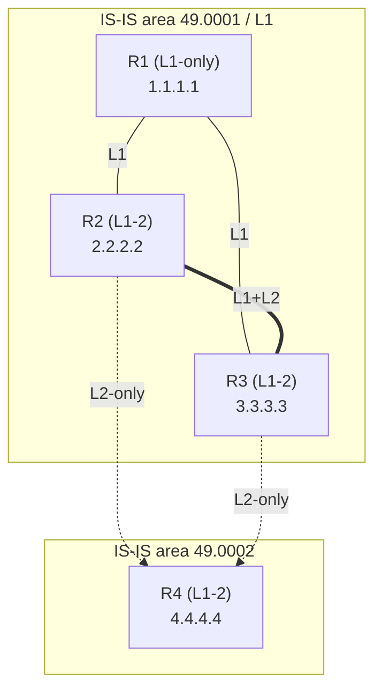

# Topology — IS-IS levels/areas and the OSPF equivalent

## IS-IS multi-level view (final state, Phase 3+)

```
                         area 49.0001 (Level 1)
            +-------------------------------------------+
            |                                           |
            |              +---------+                  |
            |        L1    |   R1    |   L1             |
            |     +--------| L1-only |--------+         |
            |     |        |1.1.1.1  |        |         |
            |     |        +---------+        |         |
            |     |                           |         |
            |  +--+------+   L1+L2   +--------+--+      |
            |  |   R2    |===========|   R3    |        |
            |  | L1-2    | cross-link| L1-2    |        |
            |  | 2.2.2.2 |           | 3.3.3.3 |        |
            |  +--+------+           +----+----+        |
            +-----|-----------------------|------------+
                  |  L2-only       L2-only|
                  |   (backbone)          |
                  +----------+ +----------+
                             | |
                        +----+-+----+
                        |    R4     |   area 49.0002
                        |  L1-2     |
                        |  4.4.4.4  |
                        +-----------+

  === L1+L2 adjacency      --- L1 adjacency      L2-only = backbone link
```

**Reading it:**
- R1 is **Level-1 only** — it lives entirely inside area 49.0001 and sees the rest of the world
  through a default route (ATT bit from R2/R3). After Phase 4 it also has a leaked /32 for R4.
- R2 and R3 are **Level-1-2** — the boundary. L1 toward R1 and each other; L2 toward R4.
- The **L2 backbone** is R2–R4, R3–R4 (and R2–R3 also carries L2). It's contiguous — required.
- R4 is in its **own area 49.0002**, reachable only across the L2 backbone.

## What each router's RIB looks like

| Router | Sees R4's loopback (4.4.4.4) as... |
|--------|------------------------------------|
| R1 (L1-only) | Phase 3: only a default route. Phase 4: a leaked /32 → optimal path |
| R2, R3 (L1-2) | An L2 route directly (they're on the backbone) |
| R4 | Local |

## OSPF equivalent (Phase 6)

```
                         area 1
            +-------------------------------------------+
            |              +---------+                  |
            |        +-----|   R1    |-----+            |
            |        |     |1.1.1.1  |     |            |
            |        |     +---------+     |            |
            +--------|---------------------|------------+
                  +--+------+         +----+----+
                  |   R2    |         |   R3    |   ABRs (area 0 <-> area 1)
                  |  ABR    |         |  ABR    |
                  +--+------+         +----+----+
                     |  area 0    area 0  |
                     +---------+ +--------+
                               | |
                          +----+-+----+
                          |    R4     |   area 0
                          +-----------+
```

Mapping: L2 backbone → **area 0**; L1 area 49.0001 → **area 1**; R2/R3 L1-2 → **ABRs**; R4 → area 0.
Same diamond, same shortest paths — different machinery. See ../docs/ISIS-vs-OSPF.md.

## Mermaid (renders on GitHub)


